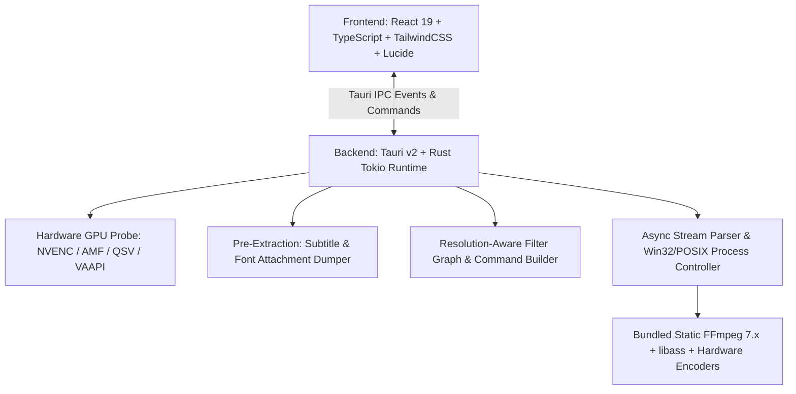

# 🌸 FloraSubs Reborn

<div align="center">

[](README.md)
[](README_TR.md)

[](https://github.com/KadirBerkpolat1/FloraSubs-Core/releases)
[](LICENSE)
[](https://tauri.app)
[](https://www.rust-lang.org)
[](https://react.dev)
[](https://github.com/KadirBerkpolat1/FloraSubs-Core/releases)

**High-Performance Fansub & Anime Video Encoding Station**

*Rebuilt from scratch with Tauri v2, Rust Tokio runtime, React 19, and TailwindCSS.*

[🚀 Download Releases](https://github.com/KadirBerkpolat1/FloraSubs-Core/releases) • [✨ Key Features](#-key-features) • [🏗️ Architecture](#%EF%B8%8F-system-architecture) • [⌨️ Shortcuts](#%EF%B8%8F-keyboard-shortcuts) • [🛠️ Build from Source](#%EF%B8%8F-building-from-source)

</div>

---

## 🌟 Why FloraSubs Reborn?

**FloraSubs Reborn** is a modern, ultra-lightweight (~25MB RAM), zero-dependency desktop workstation designed specifically for anime fansub groups, video translators, and high-efficiency encoders.

It permanently resolves common pain points found in legacy subtitle encoders:
* ❌ **Subtitles disappearing after AI upscaling** $\rightarrow$ Fixed via resolution-aware filter chain reordering.
* ❌ **Custom ASS fonts reverting to Arial** $\rightarrow$ Fixed via automated MKV font attachment extraction and path-escaped `:fontsdir=...` integration.
* ❌ **Windows crashes due to missing FFmpeg** $\rightarrow$ Fixed via self-contained, statically bundled FFmpeg 7.x + FFprobe binaries.
* ❌ **App freezing during pause/resume** $\rightarrow$ Fixed via native Win32 `NtSuspendProcess` / POSIX `SIGSTOP` kernel suspension.

---

## ✨ Key Features

### 🎨 1. Pixel-Accurate Subtitle & Font Preservation (Pre-Extraction Engine)
* **Automated Attachment Extraction:** Dumps embedded `.ass` streams and all `.ttf` / `.otf` font attachments (`-dump_attachment:t ""`) into an isolated job sandbox.
* **Zero Arial Fallbacks:** Passes the exact extracted font directory using `:fontsdir='...'` with proper Windows drive letter escaping (`C\:/...`), guaranteeing custom signboards, karaoke effects, and styles render identically to the original.
* **Upscale-Hardsub Synchronization:** In the FFmpeg filter chain, video scaling and AI filters run first, followed immediately by subtitle burning (`libass`), preserving razor-sharp vector text at 2K/4K resolutions.

### ⚡ 2. Hardware-Accelerated GPU Encoding
Auto-probes host GPU hardware with fine-tuned presets:
* **NVIDIA GeForce:** `NVENC` (H.264, HEVC, AV1) with Spatial AQ & P1–P7 presets.
* **AMD Radeon:** `AMF` (H.264, HEVC, AV1) with CQP quality rate control.
* **Intel Arc / Core:** `QuickSync (QSV)` hardware acceleration.
* **Linux VAAPI:** Native zero-copy DRM `/dev/dri/renderD128` hardware upload (`nv12`/`p010`).
* **CPU Master Quality:** `libx264` (Web anime standard), `libx265` (10-bit archive), `libsvtav1` (Film-grain tuned AV1).

### 🧠 3. 18 AI Neural Models & 2K/4K Upscaling Ecosystem
* **AnimeJaNai V3 Family (Real-ESRGAN Compact):** `2x_AnimeJaNai_HD_V3_Compact`, `UltraCompact`, `SuperUltraCompact`, `V3Sharp1_Compact`, `V3Sharp1_UltraCompact`, `V3Sharp1_SuperUltraCompact`, `SD_V1beta34_Compact`.
* **Adore & Fallin (Real-CUGAN) Family:** `2x_Adore_renarchi_fp16_DML_onnxslim`, `2x_Adore_renarchi_fp32`, `2x_fallin_soft_renarchi_fp16`, `2x_fallin_strong_renarchi_fp16`.
* **Special-Purpose Video Upscalers:** `4x-RealESRGAN-AnimeVideoV3-Compact`, `4x-RealESRGAN-v2-Compact`, `RealESRGANv2-animevideo-xsx2`, `2x_AniScale_Compact`, `2x_LD-Anime-Compact`, `sudo_shuffle_cugan_fp16_op18_clamped`, `Anime4K_Restore_UL`, `Anime4K_Upscale_HD`.
* **Categorized Model Selector:** Visual `<optgroup>` groupings (Most Popular, Ultra-Fast Real-Time, Sharp Lines, SD/Retro Restoration, 4x Video & Effects) with real-time background downloader.
* **High-Framerate Interpolation:** Smooth 24 FPS anime to 60, 120, 144, or 240 FPS via `minterpolate` and hardware-efficient rate converters.
* **Advanced Post-Processing:** Line Darkening (`curves`), Sharpness (`unsharp`), and Film Grain emulation (`noise`).
### 🎬 4. Synchronized Live Preview & Stream Server
* Zero-dependency streaming player powered by an internal, token-secured HTTP 206 Range stream server.
* Real-time multi-track subtitle switching (`.ass`, `.srt`, `.vtt`) with microsecond synchronization.

### ⏸️ 5. Zero-Freeze Process Management
* Native kernel-level **Pause** and **Resume** without memory corruption or CPU spikes.
* Uses Windows Win32 `NtSuspendProcess` / `NtResumeProcess` and Linux `SIGSTOP` / `SIGCONT`.

### 📦 6. Portable & Self-Contained
* Bundled static **FFmpeg 7.x** + **FFprobe** with `libass`, `libsvtav1`, `libx264/x265`, NVENC, AMF, and QSV enabled out of the box.


### 🗜️ 7. Smart Video Compressor (Next-Gen AV1 & HEVC 10-Bit)
* **Visually Lossless 10-Bit Compression:** Reduce high-bitrate raw videos (3 GB $\rightarrow$ 800 MB) with **%60–%75 size savings** using AV1 10-bit (`libsvtav1`) and HEVC 10-bit (`libx265`).
* **Mathematical Bitrate Estimator:** Auto-calculates exact target bitrate for Discord Basic (25 MB), Discord Nitro (50 MB), and Telegram (100 MB).
* **Dynamic Safety Badges:** Real-time visual quality indicators (🟢 Pristine / 🟡 Balanced / 🔴 Aggressive) based on resolution and bitrate density.
---

## 🏗️ System Architecture



---

## 🚀 Downloads & Installation

Pre-compiled production binaries are available on the [GitHub Releases](https://github.com/KadirBerkpolat1/FloraSubs-Core/releases) page:

| Platform | Format | Description |
| :--- | :--- | :--- |
| **Windows (Installer)** | `FloraSubs-Reborn-v1.2.0-windows-x64-Setup.exe` | Recommended native NSIS installer with bundled FFmpeg 7.x |
| **Windows (Portable)** | `FloraSubs-Reborn-v1.2.0-windows-x64-portable.zip` | Standalone portable executable with zero installation |
| **Linux (Debian/Ubuntu)** | `FloraSubs-Reborn-v1.2.0-linux-x86_64.deb` | Native DEB package |
| **Linux (Universal)** | `FloraSubs-Reborn-v1.2.0-linux-x86_64.AppImage` | Portable AppImage for all Linux distributions |
| **Linux (Archive)** | `FloraSubs-Reborn-v1.2.0-linux-x86_64.tar.gz` | Portable binary + bundled FFmpeg archive |
---

## ⌨️ Keyboard Shortcuts (Preview Player)

| Key | Action |
| :--- | :--- |
| <kbd>Space</kbd> | Toggle Play / Pause |
| <kbd>←</kbd> / <kbd>→</kbd> | Jump ±5 Seconds |
| <kbd>↑</kbd> / <kbd>↓</kbd> | Adjust Volume (±10%) |
| <kbd>M</kbd> | Toggle Mute |
| <kbd>F</kbd> | Toggle Fullscreen |

---

## 🛠️ Building from Source

### Prerequisites
* [Rust](https://www.rust-lang.org/) (v1.85 or later)
* [Bun](https://bun.sh/) (v1.1 or later) or Node.js (v20+)
* For Linux: `libwebkit2gtk-4.1-dev`, `libappindicator3-dev`, `librsvg2-dev`

### Steps

1. **Clone the repository:**
   ```bash
   git clone https://github.com/KadirBerkpolat1/FloraSubs-Core.git
   cd FloraSubs-Core
   ```

2. **Download static FFmpeg binaries:**
   ```bash
   bash scripts/download-ffmpeg.sh
   ```

3. **Install dependencies and launch dev server:**
   ```bash
   bun install
   bun run tauri dev
   ```

4. **Build production bundles:**
   ```bash
   bun run tauri build
   ```

---

## 📜 License

Distributed under the [MIT License](LICENSE). Free for fansub communities, video creators, and developers worldwide.

<div align="center">
  <sub>Developed with ❤️ for fansub groups and video creators worldwide.</sub>
</div>
