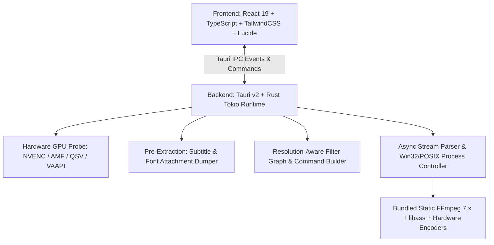

# 🎺 KaraZurna Subs (Türkçe Dokümantasyon)

<div align="center">

[](README.md)
[](README_TR.md)

[](https://github.com/KadirBerkpolat1/FloraSubs-Core/releases)
[](LICENSE)
[](https://tauri.app)
[](https://www.rust-lang.org)
[](https://react.dev)
[](https://github.com/KadirBerkpolat1/FloraSubs-Core/releases)

**Modern, Ultra Hızlı Fansub & Anime Video Kodlama İstasyonu**

*Tauri v2, Rust Tokio asenkron motoru, React 19 ve TailwindCSS ile sıfırdan inşa edildi.*

[🚀 İndir (Releases)](https://github.com/KadirBerkpolat1/FloraSubs-Core/releases) • [✨ Özellikler](#-ana-özellikler) • [🏗️ Mimari](#%EF%B8%8F-mimari-yapı) • [⌨️ Kısayollar](#%EF%B8%8F-klavye-kısayolları) • [🛠️ Derleme](#%EF%B8%8F-kaynak-koddan-derleme)

</div>

---

## 🌟 Neden KaraZurna Subs?

KaraZurna Subs; anime çeviri, fansub ve video kodlama ekipleri için özel olarak tasarlanmış, ultra hafif (~25MB RAM), bağımsız masaüstü iş istasyonudur.

Geleneksel araçlardaki **"upscale sonrası altyazıların kaybolması"**, **"özel yazı tiplerinin Arial'a düşmesi"**, **"sisteme FFmpeg kurma zorunluluğu"** ve **"işlemi duraklatırken çökme"** gibi tüm kronik sorunları kökten çözen taze bir mimariyle geliştirilmiştir.

---

## ✨ Ana Özellikler

### 🎨 1. Kusursuz Altyazı & Font Koruma (Pre-Extraction Engine)
* **Otomatik Font Ayrıştırma:** MKV kapsayıcısı içindeki tüm `.ttf` ve `.otf` font eklerini (`-dump_attachment:t ""`) izole sandbox klasörüne döker.
* **Sıfır Arial Riski:** `fontsdir` parametresi ve tam yol kaçışları (`C\:/...`) sayesinde fansub tabelaları, karaoke efektleri ve özel stiller orijinal haliyle render edilir.
* **Upscale Uyumlu Hardsub:** Filtre hattında önce video 2K/4K çözünürlüğüne yükseltilir, ardından `subtitles` filtresi uygulanır; böylece altyazı çözünürlüğü pikselleşmeden keskin kalır.

### ⚡ 2. Donanım Hızlandırmalı GPU Kodlama
Sisteminizdeki GPU donanımını otomatik tespit eder ve optimize edilmiş hazır profiller sunar:
* **NVIDIA GeForce:** `NVENC` (H.264, HEVC, AV1) + Spatial AQ
* **AMD Radeon:** `AMF` (H.264, HEVC, AV1)
* **Intel Arc / Core:** `QuickSync (QSV)`
* **Linux:** Doğrudan `/dev/dri/` üzerinden `VAAPI` (NV12 / P010 hwupload)
* **CPU Master:** `libx264` (Web uyumlu), `libx265` (10-bit Arşiv), `libsvtav1` (Film-grain korumalı AV1)

### 🧠 3. 18 Yapay Zeka Modeli & 2K/4K Süper Çözünürlük Ekosistemi
* **AnimeJaNai V3 Ailesi (Real-ESRGAN Compact):** `2x_AnimeJaNai_HD_V3_Compact`, `UltraCompact`, `SuperUltraCompact`, `V3Sharp1_Compact`, `V3Sharp1_UltraCompact`, `V3Sharp1_SuperUltraCompact`, `SD_V1beta34_Compact`.
* **Adore & Fallin (Real-CUGAN) Ailesi:** `2x_Adore_renarchi_fp16_DML_onnxslim`, `2x_Adore_renarchi_fp32`, `2x_fallin_soft_renarchi_fp16`, `2x_fallin_strong_renarchi_fp16`.
* **Özel Video & Çizgi Upscaler Modelleri:** `4x-RealESRGAN-AnimeVideoV3-Compact`, `4x-RealESRGAN-v2-Compact`, `RealESRGANv2-animevideo-xsx2`, `2x_AniScale_Compact`, `2x_LD-Anime-Compact`, `sudo_shuffle_cugan_fp16_op18_clamped`, `Anime4K_Restore_UL`, `Anime4K_Upscale_HD`.
* **Kategorize Edilmiş Model Seçici:** Görsel `<optgroup>` gruplandırması (En Çok Tercih Edilen, Ultra Hızlı Gerçek Zamanlı, Keskin Çizgili, SD / Retro Restorasyon, 4x Video & Özel Efektler) ve otomatik arka plan indiricisi.
* **Kare Üretimi (Framegen):** 24 FPS animeleri 60, 120, 144 ve 240 FPS akıcı hızlara dönüştürme desteği.
* **İleri Filtreler:** Çizgi Koyulaştırma (Line Darkening), Keskinleştirme (Unsharp Mask) ve Film Grain ekleme.
### 🎬 4. Canlı HTTP 206 Akış & Önizleme
* Harici oynatıcı bağımlılığı olmadan, dahili token korumalı HTTP 206 Range sunucusu üzerinden anında canlı video oynatma.
* Çoklu gömülü ve harici (`.ass`, `.srt`, `.vtt`) altyazı parçalarını mikrosaniye senkronuyla video üzerinde canlı önizleme.

### ⏸️ 5. Sıfır Kilitlenme Süreç Yönetimi (Win32 & POSIX)
* Kodlama esnasında bilgisayarı kasmadan tek tıkla **Duraklat (Pause)** ve **Sürdür (Resume)**.
* Windows'ta `NtSuspendProcess` / `NtResumeProcess` Win32 API'leri, Linux'ta `SIGSTOP` / `SIGCONT` sinyalleri ile sıfır CPU sömürüsü ve sıfır bellek bozulması.

### 📦 6. Sıfır Yapılandırma & Taşınabilir (Portable)
* Statik derlenmiş **FFmpeg 7.x** ve **FFprobe** uygulamanın içine gömülüdür. Sistem `PATH` değişkenine hiçbir şey eklemeniz gerekmez.


### 🗜️ 7. Akıllı Video Sıkıştırıcı (Smart Video Compressor)
* **Görsel Kayıpsız 10-Bit Sıkıştırma:** Yüksek boyutlu ham videoları (3 GB $\rightarrow$ 800 MB) **%60–%75 boyut tasarrufuyla** modern AV1 10-bit (`libsvtav1`) ve HEVC 10-bit (`libx265`) ile küçültür.
* **Matematiksel Otomatik Bitrate Hesaplayıcı:** Discord Free (25 MB), Discord Nitro (50 MB) ve Telegram (100 MB) paylaşımları için hedef boyuta göre anlık bitrate üretir.
* **Canlı Kalite Güvenlik Rozetleri:** Çözünürlük ve bitrate yoğunluğuna göre dinamik kalite durumunu (🟢 Mükemmel / 🟡 Dengeli / 🔴 Agresif) anında gösterir.
---

## 🏗️ Mimari Yapı



---

## 🚀 İndirme & Kurulum

En son kararlı sürümü [GitHub Releases](https://github.com/KadirBerkpolat1/FloraSubs-Core/releases) sayfasından edinebilirsiniz:

| Platform | Format | Açıklama |
| :--- | :--- | :--- |
| **Windows 10 / 11** | `KaraZurna-Subs-v1.3.0-windows-x64-Setup.exe` | Tam NSIS Kurulum Sihirbazı |
| **Windows Portable** | `KaraZurna-Subs-v1.3.0-windows-x64-portable.zip` | Kurulumsuz, tıkla-çalıştır zip arşivi |
| **Linux (Ubuntu/Debian)** | `KaraZurna-Subs-v1.3.0-linux-x86_64.deb` | Standart Debian sistem paketi |
| **Linux (Tüm Dağıtımlar)**| `KaraZurna-Subs-v1.3.0-linux-x86_64.AppImage` | Taşınabilir, bağımsız çalıştırılabilir paket |
| **Linux (Arşiv)** | `KaraZurna-Subs-v1.3.0-linux-x86_64.tar.gz` | Ham ikili ve FFmpeg klasörü (Arch/CachyOS/Fedora) |

---

## ⌨️ Klavye Kısayolları (Önizleme Oynatıcısı)

| Tuş | Eylem |
| :--- | :--- |
| <kbd>Space</kbd> | Oynat / Duraklat (Play / Pause) |
| <kbd>←</kbd> / <kbd>→</kbd> | ±5 Saniye Hızlı Atlama |
| <kbd>↑</kbd> / <kbd>↓</kbd> | Ses Seviyesi Ayarı (±%10) |
| <kbd>M</kbd> | Sesi Kapat / Aç (Mute Toggle) |
| <kbd>F</kbd> | Tam Ekran (Fullscreen) |

---

## 🛠️ Kaynak Koddan Derleme

### Gereksinimler
* [Rust](https://www.rust-lang.org/) (v1.85 veya üzeri)
* [Bun](https://bun.sh/) (v1.1 veya üzeri) veya Node.js (v20+)
* Linux için: `libwebkit2gtk-4.1-dev`, `libappindicator3-dev`, `librsvg2-dev`

### Adımlar

1. **Depoyu klonlayın:**
   ```bash
   git clone https://github.com/KadirBerkpolat1/FloraSubs-Core.git
   cd FloraSubs-Core
   ```

2. **Statik FFmpeg ikililerini indirin:**
   ```bash
   bash scripts/download-ffmpeg.sh
   ```

3. **Bağımlılıkları yükleyin ve geliştirici modunda başlatın:**
   ```bash
   bun install
   bun run tauri dev
   ```

4. **Üretim (Release) paketi oluşturun:**
   ```bash
   bun run tauri build
   ```

---

## 📜 Lisans

Bu proje [MIT Lisansı](LICENSE) altında lisanslanmıştır. Fansub topluluğu ve tüm video geliştiricileri için özgürce kullanılabilir, geliştirilebilir ve paylaşılabilir.

<div align="center">
  <sub>Developed with ❤️ for fansub groups and video creators worldwide.</sub>
</div>
